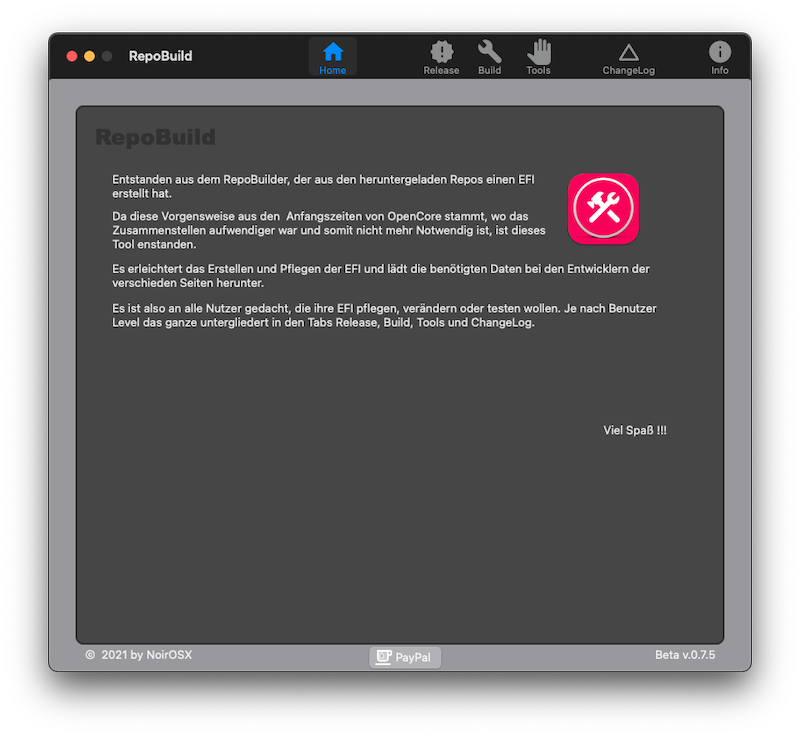

# RepoBuild - Build and Download Repos for macOS

 

### Credits
* [Entwicklern von OpenCore](https://github.com/acidanthera) 
*  [Clover](https://github.com/CloverHackyColor/CloverBootloader)
* The OSx86-Gang beim Input & fleißigen Testen
